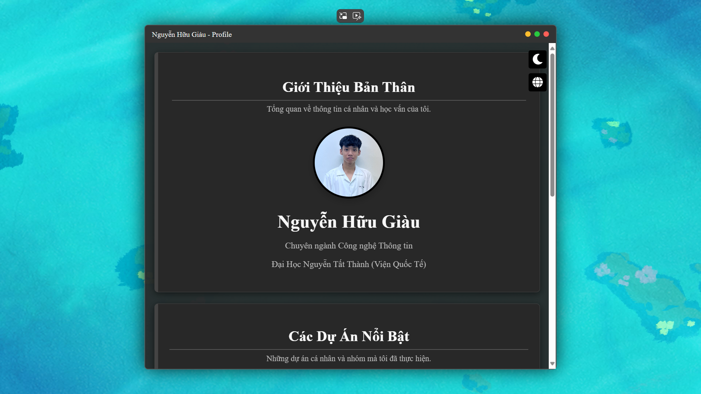

# 🖥️ Nguyễn Hữu Giàu – Hồ sơ cá nhân cơ bản
> Một hồ sơ cá nhân đơn giản và tương tác để giới thiệu thông tin của lập trình viên.

---

## 🚀 Giới thiệu

Dự án Profile-web là một hồ sơ cá nhân (personal profile) được thiết kế với giao diện cửa sổ đơn giản, mô phỏng một ứng dụng trên máy tính. Hồ sơ này tập trung vào việc trình bày thông tin cá nhân, học vấn và các dự án nổi bật của Nguyễn Hữu Giàu. Giao diện có các hiệu ứng chuyển đổi, tính năng đa ngôn ngữ và khả năng điều khiển cửa sổ, mang lại trải nghiệm tương tác trực quan.

---



---

## 🧑‍💻 Mục tiêu

- Trình bày thông tin cá nhân, học vấn, và các dự án tiêu biểu.

- Cung cấp một cách chuyên nghiệp và hấp dẫn để nhà tuyển dụng hoặc đối tác tiếp cận hồ sơ.

- Tạo ra một giao diện thân thiện với người dùng với các tính năng tương tác cơ bản.
  
---

## 🧱 Công nghệ sử dụng

| Thành phần | Mô tả |
|-----------|-------|
| `HTML5` | Cấu trúc nội dung trang web. |
| `CSS3` | Định kiểu giao diện, bao gồm responsive design, chế độ sáng/tối và hiệu ứng chuyển động. |
| `Vanilla JavaScript` | Xử lý logic tương tác của cửa sổ (thu nhỏ, phóng to, đóng, mở lại), chuyển đổi ngôn ngữ, và chế độ sáng/tối. |
| `Font Awesome` | Cung cấp các biểu tượng cho giao diện người dùng (nút điều khiển, mạng xã hội) |

---

## 🎯 Tính năng nổi bật

- ✨ Giao diện cửa sổ: Mô phỏng một ứng dụng với các nút điều khiển thu nhỏ, phóng to và đóng cửa sổ.

- 🌐 Hỗ trợ song ngữ: 🇻🇳 Tiếng Việt và 🇺🇸 English, với khả năng chuyển đổi tức thì.

- 💡 Chế độ sáng/tối: Tùy chọn chuyển đổi giữa giao diện sáng và tối.

- 🔄 Hiệu ứng chuyển động: Các chuyển động mượt mà khi cửa sổ thay đổi kích thước hoặc khi di chuột qua các phần tử.

- 🖼️ Video nền: Một video phát lặp làm nền cho toàn bộ trang web.

- ✉️ Thông tin liên hệ & Mạng xã hội: Dễ dàng kết nối qua email, số điện thoại và các nền tảng mạng xã hội phổ biến.

---

## 📂 Cấu trúc dự án

```bash
Root Folder/
├── Video - Picture/  # Thư mục chứa video nền và ảnh đại diện
│   ├── Picture.jpg
│   └── video-background.mp4
├── Profile.html      # Tệp HTML chính chứa cấu trúc nội dung
├── Profile.css       # Tùy chỉnh giao diện, chế độ sáng/tối, hiệu ứng
└── Profile.js        # Toàn bộ logic điều khiển giao diện tương tác và chuyển đổi ngôn ngữ
```

---

## 🔧 Cách triển khai

### ✅ Cách 1: Khám phá cục bộ

```bash
# Tải về: Kéo toàn bộ mã nguồn về máy tính của bạn.

# Mở: Click đúp vào tệp index.html và khám phá ngay trong trình duyệt của bạn!
```

### ✅ Cách 2: Triển khai toàn cầu
Muốn đưa hồ sơ của bạn lên mạng? Rất đơn giản!

- GitHub Pages: Cách nhanh nhất để chia sẻ dự án trực tiếp từ kho GitHub của bạn.
  
- [GitHub Pages](https://pages.github.com/)

- Netlify: Triển khai siêu tốc, tích hợp CI/CD và miễn phí HTTPS.

- [Netlify](https://netlify.com/)

- Vercel: Nền tảng tuyệt vời cho frontend, tối ưu hóa hiệu suất và trải nghiệm phát triển.

- [Vercel](https://vercel.com/)

---

## 🛡️ Giấy phép
Copyright (c) 2025 Nguyễn Hữu Giàu.

Dự án này được cấp phép dưới Giấy phép MIT. Điều đó có nghĩa là bạn có thể tự do sử dụng, chỉnh sửa và phân phối. Hãy xem tệp LICENSE để biết thêm chi tiết! Nếu bạn có ý tưởng cải thiện hoặc muốn cộng tác, đừng ngần ngại liên hệ nhé!

---

## 📬 Liên hệ
Tác giả: Nguyễn Hữu Giàu

-**Email**: HuuGiau2304@gmail.com

-**GitHub**: NgHuuGiau

-**Facebook**: HuuGiau.2304

-**Instagram**: nguyen_huugiau

-**X (Twitter)**: Nguyen_Huu_Giau

---

## 💡 Góc nhỏ chia sẻ:

- Tôi đang nỗ lực hết mình để tối ưu hóa trải nghiệm trên các thiết bị di động. Mục tiêu là mang lại sự hoàn hảo trên mọi màn hình. Hãy chờ đón những bản cập nhật tiếp theo nhé!

---

## ❗️ Lưu ý nhỏ:
